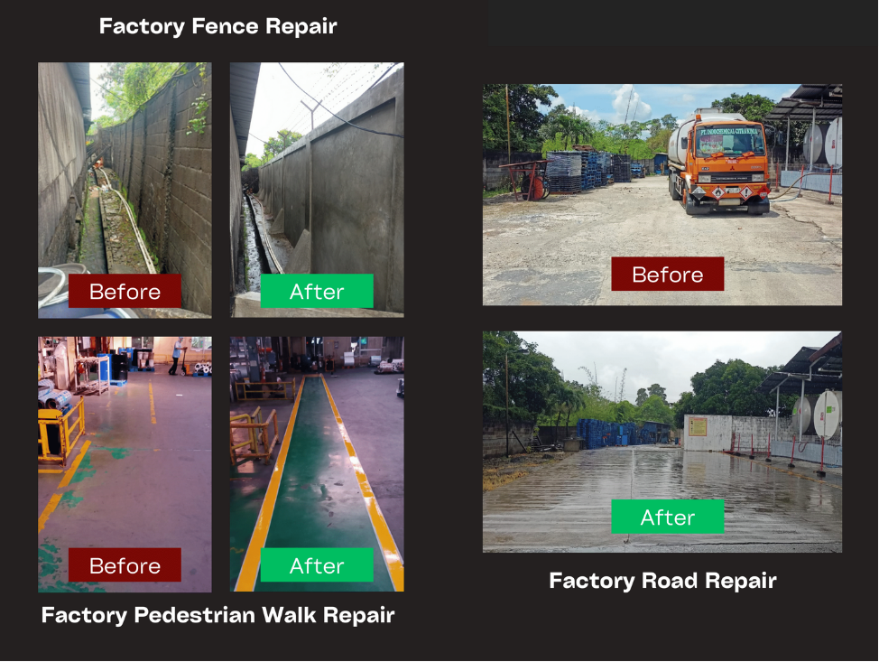
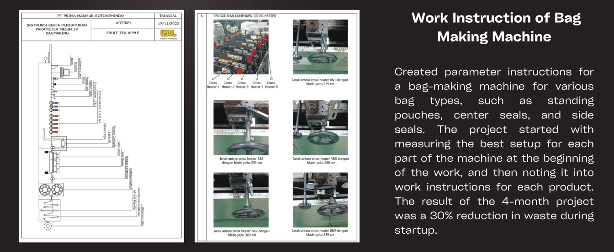
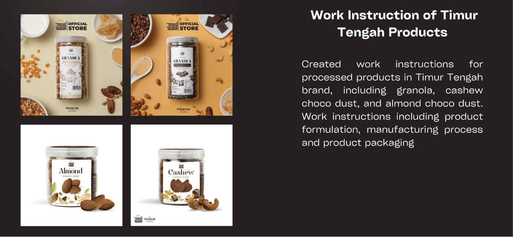
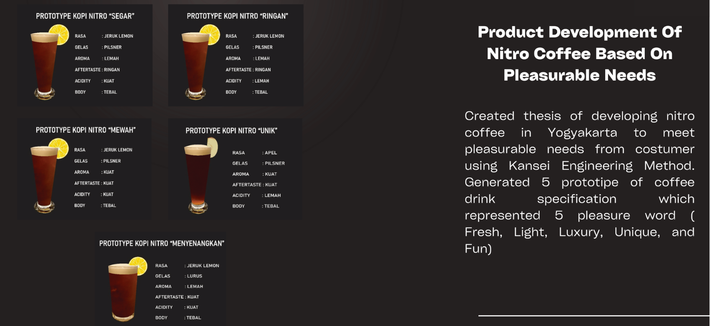

## 👋 Hello, I’m Aji Wikandaru

  
  

    
An adaptive and fast-learning person with an educational background in <strong>Agroindustrial Technology</strong> and professional experience in <strong>continuous improvement, production, warehousing, retail, and general affairs</strong>.

    
I am particularly interested in <strong>product development, operations management, business analysis, and virtual-based design</strong> to support collaborative and data-driven decision making.

  

---

## 💼 Professional Experience

### ASIIN – Auditor (Project Based)  
*Oct 2024 – Apr 2025*  
- Selected as a Student Representative from Gadjah Mada University.
- Conducted an audit of ASIIN accreditation for four study programs in Agricultural Industrial Technology at Padjadjaran University, Jatinangor, West Java.
- Led the student interview sessions, assessed accreditation documents, and provided recommendation on the audit outcomes.  

### GS1 Thailand – Student Internship  
*July 2024*  
- Developed a sustainability concept for the traceability of the PET plastic bottle recycling supply chain, integrating material suppliers, manufacturers, retailers, and end-users using barcodes and QR code system.

### PT. Prima Makmur Rotokemindo  
**Infrastructure Staff** *(Dec 2022 – Feb 2024)*  
- Planned and scheduled factory building maintenance and repairs.
- Led and supervised the infrastructure team in executing maintenance tasks.
- Implemented cost saving 20% in building management by reusing materials during infrastructure maintenance.

**Production Engineer** *(Feb 2022 – Nov 2022)*  
- Improved printing production cost efficiency by reducing solvent usage by 15% through the implementation of an additional chiller system.
- Developed parameter instructions for bag-making machines to produce various bag types (standing pouches, center seals, and side seals), reducing production waste by 30%.

### PT. Timur Tengah Indonesia (KALABORASI GROUP)
**Head of Surabaya Store** *(Nov 2021 – Feb 2022)*  
- Leading operational activities of the store and fullfilling the e-commerce service level.
- Responsible of sales performance especially in online sales and grocery sales.
- Expanded market into East Java, Bali Kalimantan, Nusa Tenggara, and Sulawesi.

**Quality Improvement Officer (Head Office Jakarta)** *(Jul 2021 – Oct 2021)*
- Created various work instructions and formulations for food production.
- Created every distribution schedule from the production center to other branches.
- Implemented a FIFO system in the racking management Stores.
- Help Human Resources determine manpower planning analysis.

**Head of Production (Dumpit Branch)** *(Jul 2021 – Jun 2021)*
- Leading production and inventory control at the Dumpit Production Center, Tangerang.
- Planning and controlling distribution from Dumpit to every branch including Karawaci, Jakarta, Bandung, Yogyakarta and Surabaya.
- Ensure quality control and assurance of all products which produced in Dumpit.

---

## 🎓 Education

**Master of Agroindustrial Technology** – Universitas Gadjah Mada  
*2024 – 2025 | GPA 4.00*  
Thesis: *Development of Warehouse Training Simulation in Virtual Reality*

**Bachelor of Agroindustrial Technology** – Universitas Gadjah Mada  
*2016 – 2020 | GPA 3.51*
Thesis: *Development of Nitro Coffee With Pleasurable Needs*

---

## 🚀 Projects Documentation

- **VR-based Warehouse Training Simulation (2025)**  
  Master’s thesis project focusing on immersive learning for warehouse operations

  <iframe src="https://drive.google.com/file/d/1yM4qawLv7spUpnqurWVumkdblbLFZD2L/preview" width="640" height="360" allow="autoplay"></iframe>

- **PET Bottle Recycling Traceability System (2024)**  
  Developed during internship at GS1 Thailand

- **Infrastructure Works (2023)**  
  Building Maintenance in Prima Makmur

- **Production Engineer Efficiency Improvement in Bagmaking Process (2022)**  
  Instruction of using bagmaking machine

- **Production Engineer Efficiency Improvement in Printing Process (2022)**  
  Project Chiller
  

- **Quality Improvement Officer at Timur Tengah Indonesia (2021)**  
  Work instruction for food products

- **Product Development of Nitro Coffee (2020)**  
  Bachelor's thesis
  
---

## 📫 Contact

- 📧 Email: wikandaruaji@gmail.com  aji.wikandaru@mail.ugm.ac.id
- 🔗 LinkedIn: [aji-wikandaru](https://www.linkedin.com/in/aji-wikandaru/)  
